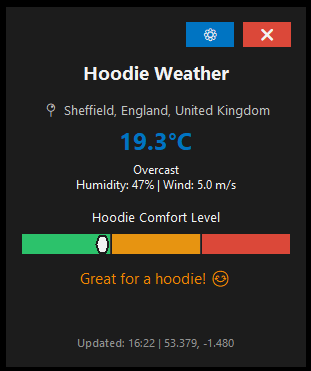

# 🧥 Hoodie Weather Widget

[](https://github.com/yourusername/hoodie-weather-widget/actions/workflows/ci.yml)
[](https://github.com/yourusername/hoodie-weather-widget/actions/workflows/release.yml)
[](https://www.python.org/downloads/)
[](LICENSE)

A beautiful desktop weather widget that helps you decide if you need a hoodie! Perfect for those who want to stay comfortable in changing weather conditions.



## ✨ Features

- 🌤️ **Real-time Weather Data**: Uses free Open-Meteo API
- 🧥 **Smart Hoodie Recommendations**: AI-powered comfort level calculation
- 📍 **Flexible Location**: Auto-detect or manual location setting
- 🎨 **Modern UI**: Beautiful, translucent widget design
- 📱 **Responsive**: Always-on-top, draggable widget
- ⚙️ **Configurable**: Easy settings panel
- 🔄 **Auto-updates**: Configurable refresh intervals
- 💻 **Cross-platform**: Works on Windows, macOS, and Linux

## 🚀 Easy Installation (Choose Your Method)

### 🌟 Super Easy - No Installation Required (Recommended)
1. **Download** `HoodieWeatherWidget_Portable.zip`
2. **Extract** and double-click `HoodieWeather.exe`
3. **Done!** Widget appears in top-right corner

### 🎯 One-Click Full Installation
1. **Download** the project folder
2. **Double-click** `easy_install.bat`
3. **Follow prompts** - everything is automatic!
4. **Enjoy** desktop shortcuts and auto-startup

### 🛠️ For Developers
```bash
git clone https://github.com/yourusername/hoodie-weather-widget.git
cd hoodie-weather-widget
pip install -r requirements.txt
python weather_widget_app.py
```

## 📱 How to Use

### Starting the Widget
- **Portable**: Double-click `HoodieWeather.exe` 
- **Installed**: Use desktop shortcut "🧥 Hoodie Weather"
- Widget appears in top-right corner automatically

### Widget Controls
- **⚙️ Gear**: Settings and location configuration
- **❌ X**: Close widget
- **Drag**: Move widget anywhere on screen
- **Right-click**: View detailed location info

## ✨ User-Friendly Features

- 🎯 **Zero Configuration**: Works immediately out of the box
- 🌍 **Auto-Location**: Detects your location automatically  
- 📱 **One-Click Install**: `easy_install.bat` handles everything
- 🖥️ **Desktop Integration**: Shortcuts and startup options
- 🧥 **Smart Recommendations**: AI-powered hoodie comfort analysis

## 🎯 How It Works

The widget calculates hoodie comfort using multiple factors:

- 🌡️ **Temperature**: Core comfort calculation
- 💨 **Wind Speed**: Wind chill effect
- 💧 **Humidity**: Perceived temperature
- 🌧️ **Precipitation**: Weather protection needs

### Comfort Levels
- 🟢 **Green Zone**: Perfect hoodie weather (10-15°C)
- 🟡 **Yellow Zone**: Good for light hoodie (5-22°C)
- 🔴 **Red Zone**: Too warm for hoodie (>28°C)

## ⚙️ Configuration

Click the ⚙️ settings button to configure:

- 📍 **Location Mode**: Auto-detect or manual
- 🌍 **Custom Location**: Set any city worldwide
- 🔄 **Update Interval**: How often to refresh weather
- 🎨 **Theme Options**: UI customization

## 🏗️ Project Structure
- No API key required - works out of the box!
- Provides accurate weather data worldwide

## Widget Features
1. **Auto-start with Windows**: The setup script adds the widget to Windows startup
2. **Top-right positioning**: Widget appears in the top-right corner of your screen
3. **Weather data**: Shows temperature, humidity, wind speed, and precipitation
4. **Hoodie comfort indicator**: 3-part progress bar (Green = Perfect, Yellow = OK, Red = Too warm)
5. **Smart recommendations**: Considers temperature, wind, humidity, and precipitation

## Hoodie Comfort Algorithm
- **Perfect (Green)**: 10-22°C, low humidity, moderate wind
- **Good (Yellow)**: 22-28°C or high humidity conditions
- **Too Warm (Red)**: Above 28°C

## Project Structure
The widget is now organized into a modular structure for easier maintenance:
- `src/ui/` - User interface components
- `src/api/` - Weather API and location services  
- `src/core/` - Core business logic and settings
- `config/` - Configuration files
- `docs/` - Documentation

## Customization
You can modify the following in `src/ui/weather_widget.py`:
- Window size and position
- Update frequency (default: 10 minutes)
- Temperature thresholds for hoodie recommendations
- Colors and styling in `src/ui/ui_components.py`

## Usage
- **Drag**: Click and drag to move the widget
- **Settings**: Click the ⚙ button to open location settings
- **Close**: Click the × button in the top-right corner
- **Location info**: Right-click for detailed location information
- **Auto-hide**: Widget stays on top but is semi-transparent

## Troubleshooting
- If weather data shows "Loading...", check your internet connection
- Widget automatically falls back to demo data if the API is unavailable
- For startup issues, check that Python is installed and in your PATH
